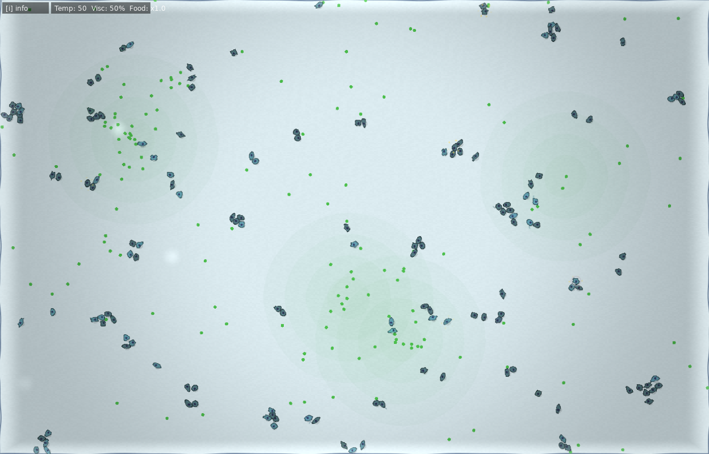
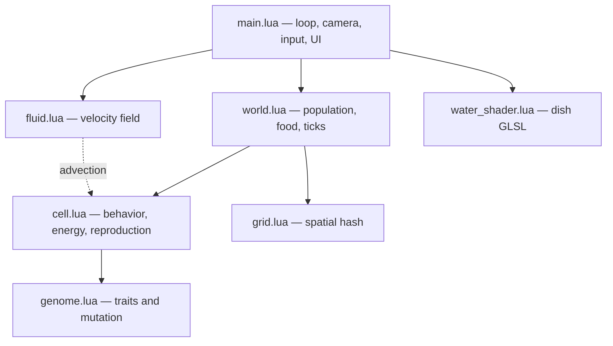

# Evocell

An artificial-life simulation in a petri dish. Cells carry mutating genomes, compete for food, and drift in a shared current — herbivores and predators are not separate species, they are regions of trait-space that selection can wander into or abandon.

Built with [Lua](https://www.lua.org/) and [LÖVE](https://love2d.org/). Runs on desktop and iOS.



## Why this exists

A compact, visual project for exploring **emergent ecology**: energy tradeoffs, spatial competition, and heredity, without a hidden “win” condition. Leave it running and the population’s average traits shift. Prod the dish — temperature, viscosity, food, currents — and watch which strategies survive.

## Features

- **26-trait genomes** — speed, size, sense, metabolism, aggression, armor, chlorophyll, venom, pack hunting, thermal resistance, and more. Most traits cost energy to maintain, so specialization has to pay for itself.
- **Emergent diets** — a cell is “a predator” when aggression (and the body to back it up) is high enough that hunting beats grazing. Lineages can drift back.
- **Energy economy** — upkeep scales with size, speed, armor, and other machinery. Reproduction spends a share of energy on a mutated child; rare jackpot mutations leap a trait across its full range.
- **Stir-able water** — shake, tilt (iOS), or drag to inject velocity into a decaying fluid field. Cells and food advect with the current; a `strength` trait lets cells brace against it.
- **Player-tuned environment** — dish temperature, viscosity, and food rate. Heat and cold tax upkeep outside a comfort band unless a lineage evolves resistance.
- **Inspect and design** — click a cell to read its genome, or open the designer and drop a hand-built organism into the dish.
- **Desktop and touch** — keyboard/mouse on desktop; tap, pinch, drag-to-stir, shake, and accelerometer tilt on iOS.

## Architecture



The interesting constraints:

- **No species table.** Predation, photosynthesis, herding, and toxicity are all genome values feeding the same update. Color, spikes, fangs, and flagella are visual reads of those same values.
- **Neighbor queries are spatially hashed**, not all-pairs, so sense/hunt/herd stay cheap as the dish fills.
- **The fluid is not Navier–Stokes.** A coarse grid with decay and neighbor blur is enough to read as water at 60fps, including on a phone.
- **Rendering splits by platform.** Desktop composites the dish through a water shader; iOS draws the world directly to avoid a mobile GPU quirk with render-to-texture.

## Run

Install [LÖVE](https://love2d.org/) 11+, then:

```bash
./launch-desktop.sh
```

On macOS this uses `love` from PATH, or `/Applications/love.app` if you installed the app bundle.

iOS (optional, needs a local Xcode scaffold):

```bash
./launch-ios.sh          # connected iPhone
./launch-ios.sh sim      # Simulator
```

## Controls

| Key | Action |
| --- | --- |
| Click cell / empty | Inspect / drop food |
| Scroll | Zoom toward cursor |
| Space | Pause |
| ↑ / ↓ | Sim speed |
| ← / → | Temperature |
| `[` / `]` | Viscosity |
| `-` / `=` | Food rate |
| F / C | Food burst / add cells |
| D / I / R | Designer / stats / reset |

On a phone: tap to inspect or drop food, drag to stir, pinch to pan/zoom, shake and tilt to push the water. Pause, speed, and settings sit on the bottom bar.

## Stack

Lua, LÖVE 11, GLSL. No extra runtime dependencies.

---

Built by [Leo Powers](https://github.com/powersleo). MIT licensed.
